# Trust Gambit - WebApp State Machine

## Overview
This document describes the state machine for the Trust Gambit web application, including all states, transitions, and constraints.

**Terminology Clarification**:
- **Stage**: Major phase of competition (Stage 1 with 120 players, Stage 2 with 16 players)
- **Round**: Each individual question (Stage 1 has 20 rounds/questions, Stage 2 has 8 rounds/questions)

---

## 1. Global Game States (Admin-Controlled)

### 1.1 GAME_NOT_STARTED
- **Description**: Initial state, registration open
- **Available Actions**: 
  - Admin: Start registration
  - Users: Fill declaration form
- **Transition to**: `GAME_STARTED` (Admin action)

### 1.2 GAME_STARTED
- **Description**: Lobbies can be formed, users can join
- **Available Actions**:
  - Admin: Create lobbies, manage capacity
  - Users: Request lobby (if form complete)
- **Transition to**: `STAGE_1_ACTIVE` (Admin action)

### 1.3 STAGE_1_ACTIVE
- **Description**: Stage 1 gameplay is active (8 pools of 15 players, 20 rounds total)
- **Sub-states**: See Round State Machine below (each question = 1 round)
- **Transition to**: `STAGE_1_COMPLETE` (All 20 rounds/questions completed)

### 1.4 STAGE_1_COMPLETE
- **Description**: Stage 1 finished, top 2 from each pool selected
- **Available Actions**:
  - System: Calculate scores, select top 2 per pool
  - Admin: Verify results, start Stage 2
- **Transition to**: `STAGE_2_ACTIVE` (Admin action)

### 1.5 STAGE_2_ACTIVE
- **Description**: Stage 2 gameplay (16 participants, 4 domains, 8 rounds total)
- **Sub-states**: See Round State Machine below (each question = 1 round)
- **Transition to**: `STAGE_2_COMPLETE` (All 8 rounds/questions completed)

### 1.6 STAGE_2_COMPLETE
- **Description**: Game finished, final results calculated
- **Available Actions**:
  - System: Calculate final rankings
  - Admin: Announce winners
- **Transition to**: `GAME_ENDED` (Admin action)

### 1.7 GAME_ENDED
- **Description**: Final state, results published
- **Available Actions**:
  - Users: View final results, trust graphs
  - Admin: Archive game data

---

## 2. User Registration & Lobby States

### 2.1 USER_FORM_STATES

#### 2.1.1 FORM_INCOMPLETE
- **Description**: User has not completed all required fields
- **Required Fields**:
  - Name
  - Email
  - Self-ratings for all 11 domains (0-10 scale)
    - Algorithms
    - Astronomy
    - Biology
    - Crypto
    - Economics
    - Finance
    - Game Theory
    - Indian History
    - Machine Learning
    - Probability
    - Statistics
- **Actions Available**: 
  - Edit form fields
  - Save draft
- **Actions Disabled**:
  - Request Lobby button (DISABLED)
- **Transition to**: `FORM_COMPLETE` (All fields filled)

#### 2.1.2 FORM_COMPLETE
- **Description**: All declaration form fields are filled
- **Actions Available**:
  - Request Lobby button (ENABLED)
  - Edit form fields
- **Transition to**: 
  - `LOBBY_REQUESTED` (User clicks Request Lobby)
  - `FORM_INCOMPLETE` (User edits and empties a field)

#### 2.1.3 LOBBY_REQUESTED
- **Description**: User has requested to join a lobby
- **Conditions**: Game state must be `GAME_STARTED`
- **System Actions**:
  - Find available lobby with capacity
  - Assign user to lobby
- **Transition to**: 
  - `LOBBY_ASSIGNED` (Lobby found with space)
  - `LOBBY_QUEUE` (No lobbies available)

#### 2.1.4 LOBBY_ASSIGNED
- **Description**: User is assigned to a specific lobby
- **Data Stored**:
  - Lobby ID
  - Lobby member list
  - Max capacity (15 for Round 1, 16 for Round 2)
- **Actions Available**:
  - View lobby members
  - View player profiles (separate tab)
  - Wait for round to start
- **Transition to**: 
  - `WAITING_FOR_QUESTION` (Round starts)

#### 2.1.5 LOBBY_QUEUE
- **Description**: Waiting for lobby with available space
- **System Actions**:
  - Continuously check for lobby availability
  - Auto-assign when space opens
- **Transition to**: `LOBBY_ASSIGNED` (Space becomes available)

---

## 3. Round State Machine (Per Question)

**Important**: Each question represents ONE ROUND. This state machine cycles for every round (question).
- Stage 1: 22 rounds (questions) across 11 domains
- Stage 2: 8 rounds (questions) across 4 domains

### 3.1 WAITING_FOR_ROUND_START
- **Description**: Lobby formed, waiting for next round (question) to be presented
- **Available Actions**:
  - View lobby members (separate tab)
  - View player profiles with self-ratings
  - Review previous rounds/scores (if any)
  - View trust graph from previous rounds
- **Admin Action**: Start round (present question)
- **Transition to**: `ROUND_QUESTION_DISPLAYED` (Admin starts round)

### 3.2 ROUND_QUESTION_DISPLAYED
- **Description**: Round begins - question is shown to all players in lobby
- **Display Information**:
  - Round number (Round 1, Round 2, etc.)
  - Question number (Q1, Q2, etc.)
  - Domain category
  - Question text
  - Time remaining (if timed)
  - Available actions: Solve, Delegate, Pass
- **Available Actions**:
  - Switch to "Players Tab" to view profiles
  - Select action (Solve/Delegate/Pass)
- **Constraints**:
  - Must choose exactly ONE action per round
  - Cannot submit until action selected
- **Transition to**: `ACTION_SELECTED` (User chooses action)

### 3.3 ACTION_SELECTED
- **Description**: User has chosen their action but not submitted
- **Sub-states**:

#### 3.3.1 SOLVE_SELECTED
- **Available Actions**:
  - Enter answer
  - Change to Delegate or Pass
- **Constraints**:
  - Answer field enabled
  - Delegation dropdown disabled
- **Transition to**: `ANSWER_SUBMITTED` (Submit answer)

#### 3.3.2 DELEGATE_SELECTED
- **Available Actions**:
  - Select player from dropdown (lobby members only)
  - View player profiles (separate tab)
  - Change to Solve or Pass
- **Constraints**:
  - Must select exactly one player
  - Cannot delegate to self
  - Cannot delegate to multiple players
- **Transition to**: `ANSWER_SUBMITTED` (Submit delegation)

#### 3.3.3 PASS_SELECTED
- **Available Actions**:
  - Confirm pass
  - Change to Solve or Delegate
- **Transition to**: `ANSWER_SUBMITTED` (Submit pass)

### 3.4 ANSWER_SUBMITTED
- **Description**: User has submitted their choice for this round (question)
- **System Actions**:
  - Lock user's submission (no changes allowed)
  - Store action type and data
  - Mark user as "submitted" for this round
- **Available Actions**:
  - View "Waiting for other players" message
  - View lobby members (separate tab)
  - See who has submitted (not their answers)
- **Constraints**:
  - ONE submission per round per user
  - Cannot change after submission
- **Transition to**: `WAITING_FOR_ROUND_END` (All players submitted or timeout)

### 3.5 WAITING_FOR_ROUND_END
- **Description**: All players have submitted for this round, system processing
- **System Actions**:
  - Validate all submissions for this round
  - Build delegation graph for this round (question)
  - Calculate correct answer
  - Check for cycles
  - Calculate scores per scoring rules (R2, R3)
- **Display Information**:
  - "Processing results..." message
  - Loading indicator
- **Transition to**: `ROUND_RESULTS_DISPLAYED` (Processing complete)

### 3.6 ROUND_RESULTS_DISPLAYED
- **Description**: Results for this round (question) are shown
- **Display Information**:
  - Round number and question
  - Delegation graph visualization for this round
  - Each player's action (Solve/Delegate/Pass)
  - Correct answer
  - Each player's score for this round
  - Trust bonus awarded (if any)
  - Updated cumulative scores across all rounds
- **Available Actions**:
  - View detailed delegation graph
  - View scoring breakdown
  - View player statistics
- **Constraints**:
  - Trust graph is NOW updated and visible for this round
  - Historical data for this round locked
- **Transition to**: 
  - `WAITING_FOR_ROUND_START` (More rounds remaining in stage)
  - Stage complete state (All rounds in stage completed)

---

## 4. Player Profile Tab States

### 4.1 PROFILE_TAB_CLOSED
- **Description**: Default state, main game view active
- **Transition to**: `PROFILE_TAB_OPEN` (User clicks "View Players")

### 4.2 PROFILE_TAB_OPEN
- **Description**: Separate tab/panel showing all lobby players
- **Display Information**:
  - List of all players in lobby
  - Each player's self-ratings (11 domains)
  - Each player's cumulative score (if round started)
  - Historical performance (previous questions)
  - Trust bonus history
- **Available Actions**:
  - Filter/sort by domain ratings
  - View detailed player stats
  - Select player for delegation (if in DELEGATE_SELECTED state)
  - Close tab
- **Constraints**:
  - Can only see players in same lobby
  - Self-ratings visible, but past actions depend on round state
- **Transition to**: `PROFILE_TAB_CLOSED` (User closes tab)

---

## 5. Trust Graph Update Constraints

### 5.1 TRUST_GRAPH_FROZEN
- **When**: During active round (from ROUND_QUESTION_DISPLAYED to ROUND_RESULTS_DISPLAYED)
- **Description**: Trust graph from previous rounds visible but not updated with current round
- **Users can see**:
  - Historical trust graphs from completed rounds
  - Previous round results
- **Users cannot see**:
  - Current round's delegation graph (being formed)
  - Current round's scores (being calculated)

### 5.2 TRUST_GRAPH_UPDATED
- **When**: After ROUND_RESULTS_DISPLAYED (round complete)
- **Description**: Trust graph updated with current round's data
- **Users can see**:
  - Full delegation graph for current round
  - All edges (who delegated to whom) in this round
  - All scores with breakdown for this round
  - Trust bonuses awarded this round
  - Cumulative totals across all completed rounds

---

## 6. State Transition Rules & Constraints

### 6.1 Form Validation Rules
```
Rule: Request Lobby Button Enabled
IF:
  - Game state = GAME_STARTED
  - User form state = FORM_COMPLETE
  - All 11 domain ratings filled (0-10)
  - Name and email provided
THEN:
  - Enable "Request Lobby" button
ELSE:
  - Disable "Request Lobby" button
  - Show validation message
```

### 6.2 Lobby Assignment Rules
```
Rule: Assign User to Lobby
IF:
  - User clicks "Request Lobby"
  - Game state = GAME_STARTED
  - Form state = FORM_COMPLETE
THEN:
  - Find lobby with (current_members < max_capacity)
  - Assign user to lobby
  - Update lobby member count
  - Transition user to LOBBY_ASSIGNED
ELSE IF no lobby available:
  - Transition user to LOBBY_QUEUE
  - Wait for lobby availability
```

### 6.3 Question Answer Rules
```
Rule: One Answer Per Round
IF:
  - User state = ANSWER_SUBMITTED for current round
THEN:
  - Disable all action buttons
  - Lock submission
  - Show "Submitted" status
  - No edits allowed
```

### 6.4 Trust Graph Visibility Rules
```
Rule: Trust Graph Update Timing (Per Round)
IF:
  - Round state != ROUND_RESULTS_DISPLAYED
THEN:
  - Show trust graph from previous rounds only
  - Hide current round's delegation graph
  
IF:
  - Round state = ROUND_RESULTS_DISPLAYED
THEN:
  - Update trust graph with current round's data
  - Show full delegation graph for this round
  - Show all scores for this round
  - Enable trust graph visualization
```

### 6.5 Delegation Selection Rules
```
Rule: Valid Delegation Target
IF:
  - User action = DELEGATE_SELECTED
THEN:
  - Must select exactly one player from dropdown
  - Dropdown contains only players in same lobby
  - Cannot select self
  - Must confirm selection before submit
  
ELSE:
  - Show validation error
  - Prevent submission
```

---

## 7. Admin State Transitions

### 7.1 Admin Controls by Game State

| Game State | Available Admin Actions |
|-----------|------------------------|
| GAME_NOT_STARTED | Start Game, Create Lobbies, Set Parameters |
| GAME_STARTED | Close Registration, Start Stage 1, Adjust Lobbies |
| STAGE_1_ACTIVE | Start Round (Question), End Round, Force Submit |
| STAGE_1_COMPLETE | Review Results, Select Top 2 per Pool, Start Stage 2 |
| STAGE_2_ACTIVE | Start Round (Question), End Round, Force Submit |
| STAGE_2_COMPLETE | Calculate Finals, Announce Winners |
| GAME_ENDED | Archive Data, Reset for New Game |

### 7.2 Admin Dashboard States
```
ADMIN_DASHBOARD
├── MONITORING_USERS (View registrations, form status)
├── MANAGING_LOBBIES (Create, modify, view lobbies)
├── CONTROLLING_ROUNDS (Start rounds/questions, view submissions)
├── VIEWING_RESULTS (Real-time scores, trust graphs per round)
└── MANAGING_GAME (Start/stop game states and stages)
```

---

## 8. Complete State Flow Example

### Example: User Journey Through One Round (Question)

1. **Initial State**: `FORM_INCOMPLETE`
   - User fills all 11 domain ratings + personal info
   - Transition to `FORM_COMPLETE`

2. **Lobby Request**: `FORM_COMPLETE`
   - Admin sets game to `GAME_STARTED`
   - "Request Lobby" button enables
   - User clicks button
   - Transition to `LOBBY_REQUESTED`

3. **Lobby Assignment**: `LOBBY_REQUESTED`
   - System finds Lobby #3 with 12/15 members
   - User assigned to Lobby #3
   - Transition to `LOBBY_ASSIGNED`

4. **Waiting**: `LOBBY_ASSIGNED`
   - User views other 12 members in "Players Tab"
   - Reviews self-ratings of potential delegation targets
   - Transition to `WAITING_FOR_ROUND_START` (when stage starts)

5. **Round 1 Begins**: `WAITING_FOR_ROUND_START` → `ROUND_QUESTION_DISPLAYED`
   - Admin starts Round 1 (Question 1, Algorithms domain)
   - Question appears on screen
   - User has options: Solve, Delegate, Pass

6. **Action Selection**: `ROUND_QUESTION_DISPLAYED` → `DELEGATE_SELECTED`
   - User clicks "Delegate"
   - Switches to "Players Tab"
   - Finds Alice with rating 9 in Algorithms
   - Selects Alice from dropdown
   - Returns to question view

7. **Submission**: `DELEGATE_SELECTED` → `ANSWER_SUBMITTED`
   - User clicks "Submit"
   - System locks submission for this round
   - Message: "Waiting for other players (8/15 submitted)"
   - User CANNOT change delegation choice

8. **Processing**: `ANSWER_SUBMITTED` → `WAITING_FOR_ROUND_END`
   - All 15 players submit for Round 1
   - System builds delegation graph for Round 1
   - System detects: User → Alice → (Alice solved correctly)
   - System calculates scores for Round 1

9. **Round 1 Results**: `WAITING_FOR_ROUND_END` → `ROUND_RESULTS_DISPLAYED`
   - Trust graph updates and displays Round 1 data
   - User sees: Delegated to Alice (distance k=1)
   - Alice solved correctly (+1)
   - User score for Round 1: λ^1 = 0.5
   - Alice received 3 delegations, trust bonus: +0.9
   - Cumulative scores updated (includes Round 1)

10. **Next Round**: `ROUND_RESULTS_DISPLAYED` → `WAITING_FOR_ROUND_START`
    - Admin starts Round 2 (Question 2)
    - Cycle repeats for all 20 rounds in Stage 1

---

## 9. State Machine Diagram (Mermaid)

```mermaid
stateDiagram-v2
    [*] --> GAME_NOT_STARTED
    
    GAME_NOT_STARTED --> GAME_STARTED: Admin starts game
    
    state GAME_STARTED {
        [*] --> USER_REGISTRATION
        
        state USER_REGISTRATION {
            [*] --> FORM_INCOMPLETE
            FORM_INCOMPLETE --> FORM_COMPLETE: All fields filled
            FORM_COMPLETE --> FORM_INCOMPLETE: Field emptied
            FORM_COMPLETE --> LOBBY_REQUESTED: Request Lobby clicked
            LOBBY_REQUESTED --> LOBBY_ASSIGNED: Lobby available
            LOBBY_REQUESTED --> LOBBY_QUEUE: No lobby available
            LOBBY_QUEUE --> LOBBY_ASSIGNED: Lobby becomes available
        }
    }
    
    GAME_STARTED --> ROUND_1_ACTIVE: Admin starts Round 1
    
    state ROUND_1_ACTIVE {
        [*] --> WAITING_FOR_QUESTION
        WAITING_FOR_QUESTION --> QUESTION_DISPLAYED: Admin starts question
        
        QUESTION_DISPLAYED --> ACTION_SELECTED: User selects action
        
        state ACTION_SELECTED {
            [*] --> SOLVE_SELECTED
            [*] --> DELEGATE_SELECTED
            [*] --> PASS_SELECTED
            
            SOLVE_SELECTED --> DELEGATE_SELECTED: Change action
            SOLVE_SELECTED --> PASS_SELECTED: Change action
            DELEGATE_SELECTED --> SOLVE_SELECTED: Change action
            DELEGATE_SELECTED --> PASS_SELECTED: Change action
            PASS_SELECTED --> SOLVE_SELECTED: Change action
            PASS_SELECTED --> DELEGATE_SELECTED: Change action
        }
        
        ACTION_SELECTED --> ANSWER_SUBMITTED: Submit action
        ANSWER_SUBMITTED --> WAITING_FOR_ROUND_END: All submitted
        WAITING_FOR_ROUND_END --> ROUND_RESULTS_DISPLAYED: Processing complete
        ROUND_RESULTS_DISPLAYED --> WAITING_FOR_QUESTION: Next question
        ROUND_RESULTS_DISPLAYED --> [*]: All questions done
    }
    
    ROUND_1_ACTIVE --> ROUND_1_COMPLETE: All questions answered
    ROUND_1_COMPLETE --> ROUND_2_ACTIVE: Admin starts Round 2
    
    state ROUND_2_ACTIVE {
        [*] --> R2_WAITING_FOR_QUESTION
        R2_WAITING_FOR_QUESTION --> R2_QUESTION_DISPLAYED
        R2_QUESTION_DISPLAYED --> R2_ACTION_SELECTED
        R2_ACTION_SELECTED --> R2_ANSWER_SUBMITTED
        R2_ANSWER_SUBMITTED --> R2_WAITING_FOR_ROUND_END
        R2_WAITING_FOR_ROUND_END --> R2_ROUND_RESULTS_DISPLAYED
        R2_ROUND_RESULTS_DISPLAYED --> R2_WAITING_FOR_QUESTION: Next question
        R2_ROUND_RESULTS_DISPLAYED --> [*]: All questions done
    }
    
    ROUND_2_ACTIVE --> ROUND_2_COMPLETE: All questions answered
    ROUND_2_COMPLETE --> GAME_ENDED: Admin announces winners
    GAME_ENDED --> [*]
```



---

## 10. Data Models for State Management

### 10.1 User State Object
```javascript
{
  userId: string,
  name: string,
  email: string,
  formState: "INCOMPLETE" | "COMPLETE" | "LOBBY_REQUESTED" | "LOBBY_ASSIGNED",
  domainRatings: {
    algorithms: number,        // 0-10
    finance: number,
    economics: number,
    statistics: number,
    probability: number,
    machineLearning: number,
    crypto: number,
    biology: number,
    indianHistory: number,
    gameTheory: number
  },
  lobbyId: string | null,
  currentRoundState: "WAITING" | "DISPLAYED" | "ACTION_SELECTED" | "SUBMITTED" | "RESULTS",
  selectedAction: {
    type: "SOLVE" | "DELEGATE" | "PASS",
    answer?: string,              // if SOLVE
    delegateTo?: string,          // if DELEGATE (userId)
    submittedAt?: timestamp
  },
  cumulativeScore: number,
  roundScores: Array<{
    roundId: string,
    roundNumber: number,
    stage: 1 | 2,
    score: number,
    action: object,
    timestamp: timestamp
  }>
}
```

### 10.2 Game State Object
```javascript
{
  gameId: string,
  gameState: "NOT_STARTED" | "STARTED" | "STAGE_1_ACTIVE" | "STAGE_1_COMPLETE" | "STAGE_2_ACTIVE" | "STAGE_2_COMPLETE" | "ENDED",
  currentStage: 1 | 2,           // Major phase (Stage 1 or Stage 2)
  currentRound: number,          // Current round (question) number within stage
  totalRounds: {
    stage1: 22,                  // 11 domains × 2 questions each
    stage2: 8                    // 4 domains × 2 questions each
  },
  parameters: {
    lambda: 0.5,                 // Linear decay
    beta: 0.3,                   // Trust bonus weight
    gamma: 0.7                   // Cycle penalty decay
  },
  lobbies: Array<LobbyObject>,
  rounds: Array<RoundObject>     // Each round = one question
}
```

### 10.3 Lobby State Object
```javascript
{
  lobbyId: string,
  stage: 1 | 2,                  // Which stage this lobby is for
  maxCapacity: 15 | 16,          // 15 for Stage 1, 16 for Stage 2
  currentMembers: Array<userId>,
  memberCount: number,
  status: "OPEN" | "FULL" | "IN_GAME" | "COMPLETED",
  currentRound: number | null,   // Current round (question) number
  trustGraphHistory: Array<TrustGraphSnapshot>  // History across all rounds
}
```

### 10.4 Round State Object (Each Question = One Round)
```javascript
{
  roundId: string,
  roundNumber: number,           // Round number (1-20 for Stage 1, 1-8 for Stage 2)
  stage: 1 | 2,
  questionId: string,
  domain: string,
  questionText: string,
  correctAnswer: string,
  state: "NOT_STARTED" | "ACTIVE" | "COLLECTING_ANSWERS" | "PROCESSING" | "RESULTS_PUBLISHED",
  submissions: Array<{
    userId: string,
    action: object,
    timestamp: timestamp
  }>,
  delegationGraph: {
    nodes: Array<userId>,
    edges: Array<{from: userId, to: userId}>,
    cycles: Array<Array<userId>>
  },
  scores: Map<userId, number>,   // Scores for this round only
  trustBonuses: Map<userId, number>,
  timestamp: {
    started: timestamp,
    ended: timestamp
  }
}
```

---

## 11. UI Component States

### 11.1 Request Lobby Button States
```javascript
// Disabled State
{
  enabled: false,
  reason: "Please complete all declaration form fields",
  tooltip: "Fill all 11 domain ratings and personal information"
}

// Enabled State
{
  enabled: true,
  text: "Request Lobby",
  onClick: handleLobbyRequest
}

// Loading State
{
  enabled: false,
  text: "Requesting...",
  showSpinner: true
}

// Assigned State
{
  enabled: false,
  text: "Assigned to Lobby #3",
  color: "success"
}
```

### 11.2 Action Selection UI States
```javascript
// Default State - No selection
{
  solveButton: { selected: false, enabled: true },
  delegateButton: { selected: false, enabled: true },
  passButton: { selected: false, enabled: true },
  submitButton: { enabled: false, text: "Select an action first" }
}

// Solve Selected
{
  solveButton: { selected: true, enabled: true },
  delegateButton: { selected: false, enabled: true },
  passButton: { selected: false, enabled: true },
  answerInput: { visible: true, enabled: true, required: true },
  submitButton: { enabled: true, text: "Submit Answer" }
}

// Delegate Selected
{
  solveButton: { selected: false, enabled: true },
  delegateButton: { selected: true, enabled: true },
  passButton: { selected: false, enabled: true },
  playerDropdown: { visible: true, enabled: true, required: true },
  submitButton: { enabled: false, text: "Select a player first" }
}

// Delegate Selected + Player Chosen
{
  playerDropdown: { value: "Alice", visible: true, enabled: true },
  submitButton: { enabled: true, text: "Submit Delegation to Alice" }
}

// Submitted State
{
  solveButton: { enabled: false },
  delegateButton: { enabled: false },
  passButton: { enabled: false },
  submitButton: { enabled: false, text: "Submitted ✓" },
  message: "Waiting for other players (12/15 submitted)"
}
```

### 11.3 Players Tab States
```javascript
// Closed State
{
  visible: false,
  toggleButton: { text: "View Players", icon: "👥" }
}

// Open State - Before Question
{
  visible: true,
  toggleButton: { text: "Hide Players", icon: "✕" },
  playerList: Array<PlayerProfile>,
  sortBy: "alphabetical" | "rating" | "score",
  filterDomain: null | string,
  actions: ["View", "Sort", "Filter"]
}

// Open State - During Delegation Selection
{
  visible: true,
  playerList: Array<PlayerProfile>,
  selectionMode: true,
  selectedPlayer: null | userId,
  actions: ["View", "Sort", "Filter", "Select for Delegation"]
}

// Open State - After Results
{
  visible: true,
  playerList: Array<PlayerProfileWithScores>,
  showScores: true,
  showTrustGraph: true,
  actions: ["View", "Sort", "Filter", "View Trust Graph"]
}
```

---

## 12. Error States & Edge Cases

### 12.1 Form Validation Errors
- **Incomplete Rating**: Show which domain is missing
- **Invalid Rating**: Must be 0-10
- **Missing Email**: Show validation message
- **Duplicate Email**: Prevent registration

### 12.2 Lobby Assignment Errors
- **Game Not Started**: Show "Game has not started yet"
- **All Lobbies Full**: Move to LOBBY_QUEUE state
- **Already Assigned**: Prevent duplicate assignment

### 12.3 Submission Errors
- **Already Submitted**: Lock UI, show error
- **No Action Selected**: Disable submit button
- **Delegation to Self**: Show validation error
- **Network Timeout**: Retry mechanism, save locally

### 12.4 Processing Errors
- **Cycle Detection**: Handle gracefully, show cycle visualization
- **Scoring Calculation**: Validate with test cases
- **Trust Graph Generation**: Handle disconnected nodes

---

## 13. Performance Considerations

### 13.1 State Updates
- Use optimistic UI updates for better UX
- Debounce form field changes
- Batch state updates for multiple users

### 13.2 Real-time Synchronization
- WebSocket for live submission counts
- Polling fallback for trust graph updates
- Cache player profiles to reduce API calls

### 13.3 Scalability
- Pagination for large player lists
- Lazy load trust graph visualizations
- Compress historical data

---

## 14. Security Constraints

### 14.1 Data Access Rules
- Users can only see players in their lobby
- Submissions are encrypted until round ends
- Admin actions are logged and auditable

### 14.2 State Manipulation Prevention
- Server-side validation of all state transitions
- Prevent client-side state tampering
- Rate limiting on form submissions

### 14.3 Timing Attack Prevention
- Randomize processing delays
- Hide submission timestamps during active question
- Batch reveal results simultaneously

---

## Summary

This state machine ensures:
1. ✅ Request Lobby only works when form is complete
2. ✅ Lobby assignment only when game has started and capacity available
3. ✅ Exactly one answer per round (question) per user
4. ✅ Trust graph not updated until round results are displayed
5. ✅ Players can view profiles in separate tab during delegation
6. ✅ Clear state transitions with proper constraints
7. ✅ Admin controls for game flow (stages and rounds)
8. ✅ Proper error handling and edge cases
9. ✅ Real-time synchronization support
10. ✅ Security and data access controls

**Terminology Summary**:
- **Stage**: Major phase (Stage 1 with 120 players, Stage 2 with 16 players)
- **Round**: Each individual question (20 rounds in Stage 1, 8 rounds in Stage 2)

The state machine is designed to be:
- **Deterministic**: Clear transitions and conditions
- **Scalable**: Supports 120 players in Stage 1, 16 in Stage 2
- **Robust**: Handles errors and edge cases
- **User-friendly**: Clear UI states and feedback
- **Secure**: Prevents cheating and data leaks
